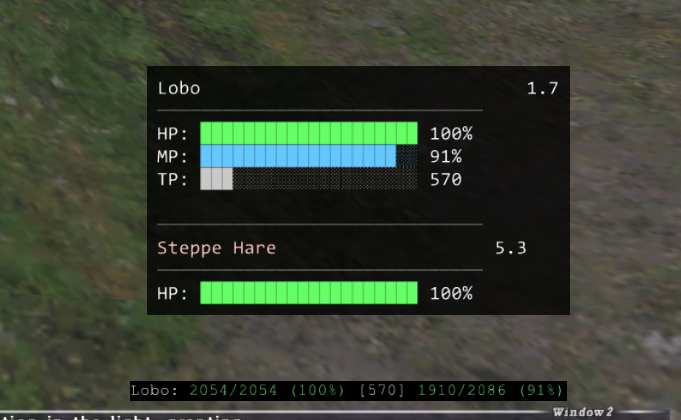

# PetInfo for Windower

**A Windower addon that recreates Ashita's beautiful ImGui-style pet interface with full functionality.**

**Author:** Palmer (Zodiarchy @ Asura)  
**Version:** 1.0  
**Date:** 2025-07-22

## Visual Comparison



**Top:** PetInfo - Clean GUI-style display with target tracking  
**Bottom:** PetTP - Traditional text-based display

*Our addon successfully recreates Ashita's polished interface while running on Windower!*

## Features

### ✅ **Complete Pet Monitoring**
- **HP Bar** - Color-coded (green/yellow/orange/red) with percentage
- **MP Bar** - Full support for Puppetmaster automatons via packet parsing
- **TP Bar** - Real-time TP tracking with 1000+ highlighting
- **Distance Tracking** - Live distance updates to your pet

### ✅ **Advanced Target Tracking**
- **Target Detection** - Shows what your pet is fighting
- **Target HP** - Enemy health with color-coded progress bar
- **Target Distance** - Distance from you to the target
- **Real-time Updates** - Instant target switching detection

### ✅ **Professional Interface**
- **Progress Bars** - Visual bars using block characters (█ ░)
- **Color Coding** - Intuitive health-based coloring
- **Clean Layout** - Separator lines and organized sections
- **Draggable Window** - Position anywhere on screen

## Supported Pet Types

| Pet Type | HP | MP | TP | Target |
|----------|----|----|-------|--------|
| **Puppetmaster Automatons** | ✅ | ✅ | ✅ | ✅ |
| **Beastmaster Pets** | ✅ | ❌* | ✅ | ✅ |
| **Summoner Avatars** | ✅ | ❌* | ✅ | ✅ |
| **Dragoon Wyverns** | ✅ | ❌* | ✅ | ✅ |

*\*MP data not available through Windower API for these pet types*

## Installation

1. **Download** `petinfo.lua` and place in `Windower4/addons/petinfo/`
2. **Load** with `//lua load petinfo`
3. **Position** with `//petinfo pos <x> <y>` if desired

## Commands

```
//petinfo help - Show command list
//petinfo pos <x> <y> - Set window position
//petinfo save - Save current settings
//petinfo test - Show test display
//petinfo reload - Reload the addon